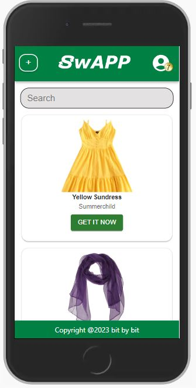

# SwAPP - by Bit by Bit

## Project brief

Our project brief was to spend five weeks solving a problem we felt was important by building a full-stack web application. Our team - Bit by Bit - is comprised of Alice, Gregor, John, Latifa, Maddie and Neil. We decided to build an app that would help people to reduce their carbon footprint by making it easier to find and exchange old clothes with other users.

## Our app

Swapp is designed for a community of users to share clothes with each other. Users can upload items of clothing they no longer want, and browse items that other users have uploaded. After signing up, users receive a token when uploading an item, and can then use that token to claim an item another user has listed. Once the exchange is confirmed, the two users can arrange to meet up and exchange the items, or the item can be sent via post. The app currently has no restriction against other non-clothing items being uploaded, and as a stretch goal we would like to generalise the app to all types of products.

